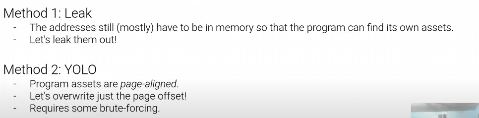

# ASLR (address space layout randomisation) : 

Address Space Layout Randomization (or ASLR) is the randomization of the place in memory where the program, shared libraries, the stack, and the heap are. This makes can make it harder for an attacker to exploit a service, as knowledge about where the stack, heap, or libc can't be re-used between program launches. This is a partially effective way of preventing an attacker from jumping to, for example, libc without a leak.

source : https://ctf101.org/binary-exploitation/address-space-layout-randomization/

# How ASLR works 

**When a process starts:**

- ASLR shifts memory segments to random addresses.
- These segments include the stack, heap, shared libraries, and sometimes the executable itself.
- Each run of the program has a different memory layout, making the memory addresses non-deterministic.

# technical details 

## Entropy in ASLR:
`The number of possible memory locations ASLR can choose from is known as entropy.`

- On a 32-bit system: Limited to ~16 bits of entropy (because of smaller address space).
- On a 64-bit system: Higher entropy (~28–48 bits depending on OS), making it significantly harder to guess memory locations.

## Pseudo random algorithm used to randomise addresses

- Relies on a pseudo-random number generator seeded during process creation.
- Each segment is offset by a random value within a certain range, defined by the operating system.

# why ASLR is used 

ASLR makes it extremely hard to do buffer overflow and stack smashing attacks since we cannot predict if our offset + payload will land at the correct address.

# Key observations we can find if we run an ASLR enabled binary multiple times and map the mem addresses

**Executable Base Address:**

- The starting address of /usr/bin/bash (00400000) remains fixed. Some OSs randomize this for PIE (Position-Independent Executables).
  
**Heap Randomization:**

- The heap starts at a random address (00c8f000). Repeated runs of the process will change this location.
Shared Libraries:

- `Libraries like libc.so.6 are loaded at randomized addresses (7f6c8a000000).`

**Stack Randomization:**

- The stack begins at a random address (7ffd3c10a000), and this location changes for every new process.

# So how can we workaround ASLR?

While ASLR is a robust defense mechanism, it is not invincible. Attackers can sometimes bypass ASLR if vulnerabilities are present or if they exploit certain weaknesses in the implementation of ASLR itself. Understanding these weaknesses is crucial for both defenders and attackers, as it helps in designing better security strategies and detecting potential flaws in systems.

Lets look at some methods to exploit weaknesses :

- there is one more situational method where we have to bruteforce the offsets.

- Pages are always aligned to 0x1000 i.e in laymans terms the last 3 nibbles of an address are never changed.

- if we overwrite the last two least significant bytes of a pointer, we only have to brute force one nibble which can only have 16 values to redirect the pointer to somwhere else in the same page

- in little endian we have to we overwrite the first two bytes

- Source : https://www.youtube.com/watch?v=SBqERAbDdAk&list=PL-ymxv0nOtqpmHdeii3NsBurJSvuMTKLL

# What tools can attackers use to bypass ASLR?

 **Info leak exploits** :

 - we can use tools like `gdb,pwngdb or IDA or ghidra` we can try bruteforcing the page constants
  
 **ROP Chain exploits** :
 - ROP chains allow attackers to execute code at known locations by using existing code fragments in memory. If an attacker can leak a few addresses and bypass ASLR, they can chain ROP gadgets to perform malicious actions.
 - Tools -  ROPgadget : A tool that helps identify ROP gadgets in a program.

**Heap Spraying** : 

 - Heap spraying involves placing a large number of copies of malicious payloads in the heap to increase the chances of hitting the target address during an attack. This can work around ASLR if the heap isn’t randomized effectively.

 - PyROPS: A Python tool that aids in creating heap-spraying exploits.

# Resources : 
https://www.youtube.com/watch?v=SBqERAbDdAk&list=PL-ymxv0nOtqpmHdeii3NsBurJSvuMTKLL

https://ctf101.org/binary-exploitation/address-space-layout-randomization/

https://securitymaven.medium.com/demystifying-aslr-understanding-exploiting-and-defending-against-memory-randomization-4dd8fe648345

