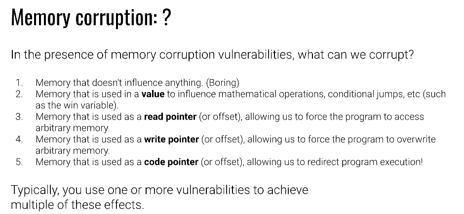

# Memory erros - stack smashing - stack overflow


rewriting this image with my own understanding : 

```c
int main(int argc, char **argv, char **envp){
    print_quoted(argv[1]); // we can pass whatevr or however long of an argument we want and it will still take it
    return 0;
}
void print_quoted(char *s){
    printf(quote(s));
    return;

}

char *quote(char *s){
    char output[50];
    sprintf(output, "\"%s\"",s); // fills output with the string we are constructing currently. since user input can wbe however long  but if u look at the output initialisation it only expects 50 bytes of input
    return output;
}
```

- sine we are using sprintf which doesnt pass around size of the string we can stack overflow with a cmd line arg and overwrite the stack to induce some kind of malicious behaviour.

- exactly what malicious behavioru depends on the stack we are overflowing into and our malicous input.


this image shows some of the behaviours we can induce :




thus in a ctf scenario if we have overflow the stack enough with out input that we can run the control flow into the address of the win function we can then run the win function to get our flag etc.


