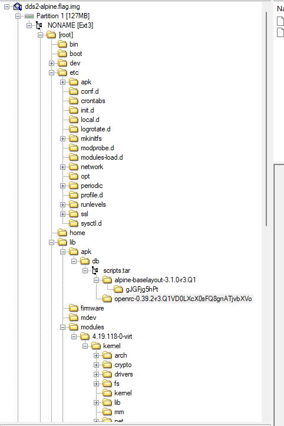

# Disk, disk, sleuth! II

lets get the fisk first using 

`wget https://mercury.picoctf.net/static/2e54f22211165e9f33a47bdb8a09268b/dds2-alpine.flag.img.gz`

unzipped the image using `gunzip`.

then we open the image using `FTK imager`.



didnt find anything useful but got to know it has a linux partition .

looking at the hints i get to know we have to use sleuth kit instead so i learn what it is from here : https://www.sleuthkit.org

lets find the linux kernel offset first ;

```
ss@Satwik:/mnt/c/Cryptonite/pwn.college_satwik/Forensics/files$ mmls dds2-alpine.flag.img
DOS Partition Table
Offset Sector: 0
Units are in 512-byte sectors

      Slot      Start        End          Length       Description
000:  Meta      0000000000   0000000000   0000000001   Primary Table (#0)
001:  -------   0000000000   0000002047   0000002048   Unallocated
002:  000:000   0000002048   0000262143   0000260096   Linux (0x83)
ss@Satwik:/mnt/c/Cryptonite/pwn.college_satwik/Forensics/files$
```

its `2048`.

lets now grep the linux partition for : down-at-the-bottom.txt

```
ss@Satwik:/mnt/c/Cryptonite/pwn.college_satwik/Forensics/files$ fls -r -p -o 2048 dds2-alpine.flag.img | grep down-at-the-bottom.txt
r/r 18291:      root/down-at-the-bottom.txt
ss@Satwik:/mnt/c/Cryptonite/pwn.college_satwik/Forensics/files$
```

its in the root.

now if we icat with the offset and node number.

```
ss@Satwik:/mnt/c/Cryptonite/pwn.college_satwik/Forensics/files$ icat -o 2048 dds2-alpine.flag.img 18291
   _     _     _     _     _     _     _     _     _     _     _     _     _
  / \   / \   / \   / \   / \   / \   / \   / \   / \   / \   / \   / \   / \
 ( p ) ( i ) ( c ) ( o ) ( C ) ( T ) ( F ) ( { ) ( f ) ( 0 ) ( r ) ( 3 ) ( n )
  \_/   \_/   \_/   \_/   \_/   \_/   \_/   \_/   \_/   \_/   \_/   \_/   \_/
   _     _     _     _     _     _     _     _     _     _     _     _     _
  / \   / \   / \   / \   / \   / \   / \   / \   / \   / \   / \   / \   / \
 ( s ) ( 1 ) ( c ) ( 4 ) ( t ) ( 0 ) ( r ) ( _ ) ( n ) ( 0 ) ( v ) ( 1 ) ( c )
  \_/   \_/   \_/   \_/   \_/   \_/   \_/   \_/   \_/   \_/   \_/   \_/   \_/
   _     _     _     _     _     _     _     _     _     _     _
  / \   / \   / \   / \   / \   / \   / \   / \   / \   / \   / \
 ( 3 ) ( _ ) ( d ) ( b ) ( 5 ) ( 9 ) ( d ) ( a ) ( a ) ( 5 ) ( } )
  \_/   \_/   \_/   \_/   \_/   \_/   \_/   \_/   \_/   \_/   \_/
ss@Satwik:/mnt/c/Cryptonite/pwn.college_satwik/Forensics/files$

```

we get the flag.

# The flag :

`picoCTF{f0r3ns1c4t0r_n0v1c3_db59daa5}`