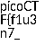
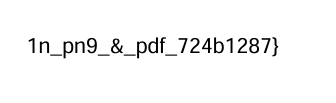

# secret of the polyglot (easy)

`ss@Satwik:/mnt/c/Cryptonite/pwn.college_satwik/Forensics/files$ wget https://artifacts.picoctf.net/c_titan/97/flag2of2-final.pdf`

When i install the file i can see that it is a pdf of some kind. just to be sure i run `file` on it.

i get some interesting info :

```
ss@Satwik:/mnt/c/Cryptonite/pwn.college_satwik/Forensics/files$ file flag2of2-final.pdf
flag2of2-final.pdf: PNG image data, 50 x 50, 8-bit/color RGBA, non-interlaced
ss@Satwik:/mnt/c/Cryptonite/pwn.college_satwik/Forensics/files$
```

it seems like it is a png also. 

i just change the extension of the file from pdf to png and i get this

 

and when open the pdf we get this : 



# The FLAG :

`picoCTF{f1u3n7_1n_pn9_&_pdf_724b1287}`