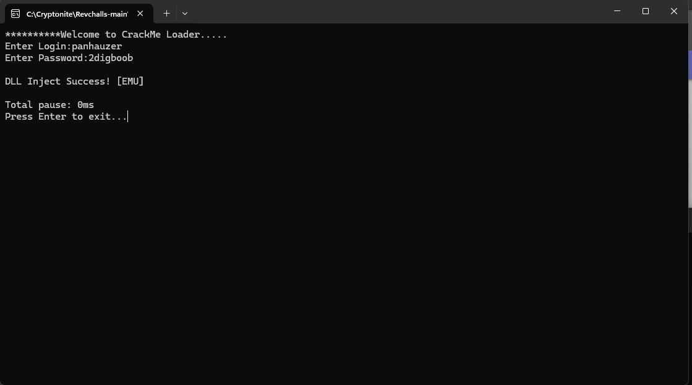

# Chall.exe

# Solved




When running `chall.exe`, the program prompts for:
1. User ID
2. Password

The goal is to find the correct credentials probably.

## Solution

### Decompilation
I decompiled the binary using a decompiler (dogbolt) to analyze the code. The output was saved in `challexeDecompiled.c` using dogbolt decompiler since ghidra was acting up.

### Code Analysis
The decompiled code revealed some interesting stuff :
- Anti-debugging : The binary includes checks to detect debuggers
- **Custom Virtual Machine**: The program uses a bytecode interpreter (`sub_1400048e0`) for execution obfuscation


### Finding the Credentials
After analyzing the code, I searched for string literals and found the key validation function `sub_140002d30` which handles the credential checking logic.

## The Critical Code Snippet

At lines **1133-1135** in the decompiled code, I found the hardcoded credentials:

```c
int64_t var_20d0;
memset(&var_20d0, 0, 0x2098);
data_14000d740 = 0;
char i_11 = *arg1;
int64_t rcx_1;

// ... 

int64_t var_20da;
__builtin_strcpy(&var_20da, "panhauzer");
int64_t var_20e3;
__builtin_strncpy(&var_20e3, "2digboob", 9);
int32_t var_21ec;
__builtin_memset(&var_21ec, 0, 0x104);
```

### Key Observations:

1. **`var_20da`** stores the string `"panhauzer"` - this is the **userId**
2. **`var_20e3`** stores the string `"2digboob"` - this is the **password**
3. These values are copied into local variables using `__builtin_strcpy` and `__builtin_strncpy`

The function `sub_140002d30` appears to be a validation call that:
- Takes two arguments (`arg1` for userId, `arg2` for password)
- Compares them against the hardcoded values
- Returns `1` (success) or `0` (failure) based on the comparison

# finally

Run `chall.exe` and enter:
- **userId**: `panhauzer`
- **password**: `2digboob`


# mitigations


encrypt the values
and if its an exe at some point it will get cracked

## Tools Used
- Dogbolt decompiler


