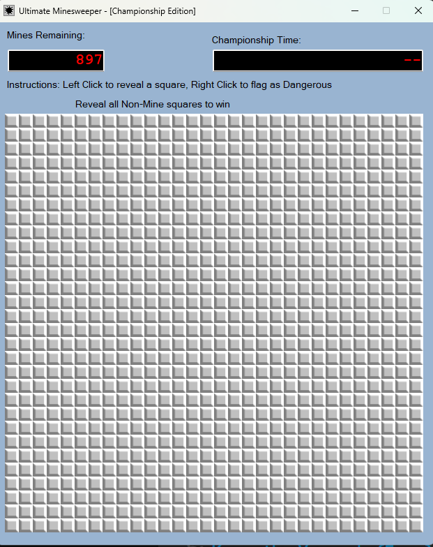
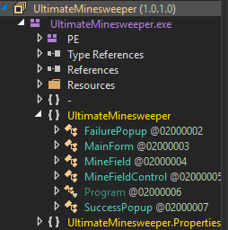
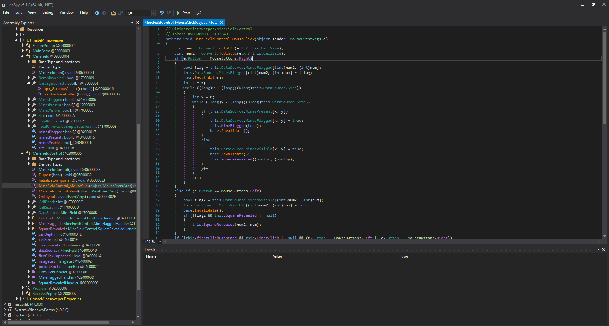
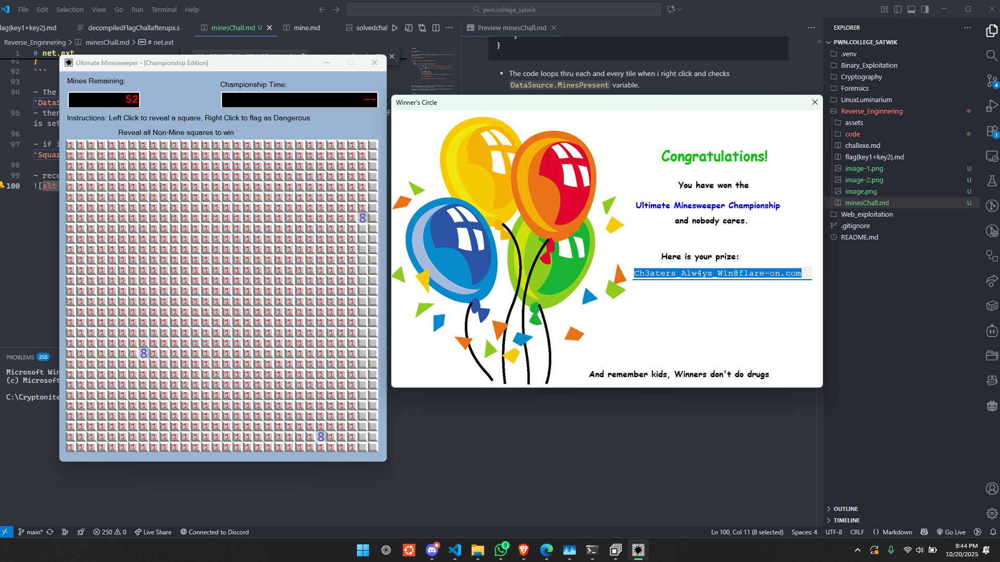

# net.ext


# Flag : 

`Ch3aters_Alw4ys_W1n@flare-on.com`


#





- its the mines game and the challenge mentions net so its prlly .net so i use dnspy instantly.




**looking thru the code flag aint hardcoded.**

```csharp
	private void AllocateMemory(MineField mf)
		{
			for (uint num = 0U; num < MainForm.VALLOC_NODE_LIMIT; num += 1U)
			{
				for (uint num2 = 0U; num2 < MainForm.VALLOC_NODE_LIMIT; num2 += 1U)
				{
					bool flag = true;
					uint r = num + 1U;
					uint c = num2 + 1U;
					if (this.VALLOC_TYPES.Contains(this.DeriveVallocType(r, c)))
					{
						flag = false;
					}
					mf.GarbageCollect[(int)num2, (int)num] = flag;
				}
			}
		}

```

this means the board size is `30x30` but i found something even more interesting 
which is MinefiledControl_mouselclick method.

i modified its right click feature to basically using the edit method and then recompiled it and ran the code to get the flag :


```csharp
// UltimateMinesweeper.MineFieldControl
// Token: 0x06000031 RID: 49
private void MineFieldControl_MouseClick(object sender, MouseEventArgs e)
{
	uint num = Convert.ToUInt32(e.Y / this.CellSize);
	uint num2 = Convert.ToUInt32(e.X / this.CellSize);
	if (e.Button == MouseButtons.Right)
	{
		bool flag = this.DataSource.MinesFlagged[(int)num2, (int)num];
		this.DataSource.MinesFlagged[(int)num2, (int)num] = !flag;
		base.Invalidate();
		int x = 0;
		while ((long)x < (long)((ulong)this.DataSource.Size))
		{
			int y = 0;
			while ((long)y < (long)((ulong)this.DataSource.Size))
			{
				if (this.DataSource.MinesPresent[x, y])
				{
					this.DataSource.MinesFlagged[x, y] = true;
					this.MineFlagged(true);
					base.Invalidate();
				}
				else
				{
					this.DataSource.MinesVisible[x, y] = true;
					base.Invalidate();
					this.SquareRevealed((uint)x, (uint)y);
				}
				y++;
			}
			x++;
		}
	}
	else if (e.Button == MouseButtons.Left)
	{
		bool flag2 = this.DataSource.MinesVisible[(int)num2, (int)num];
		this.DataSource.MinesVisible[(int)num2, (int)num] = true;
		base.Invalidate();
		if (!flag2 && this.SquareRevealed != null)
		{
			this.SquareRevealed(num2, num);
		}
	}
	if (!this.firstClickHappened && this.FirstClick != null && (e.Button == MouseButtons.Left || e.Button == MouseButtons.Right))
	{
		this.firstClickHappened = true;
		this.FirstClick();
	}
}
```

- The code loops thru each and every tile when i right click and checks `DataSource.MinesPresent` variable.
- then we flag that tile with the `MinesFlagged` variable and `MinesFlagged` fn is set.

- if it isnt a mine : we set the MinesVisible flag to true and call the `SquareRevealed` function.

- recompile and run the exe to get the flag




