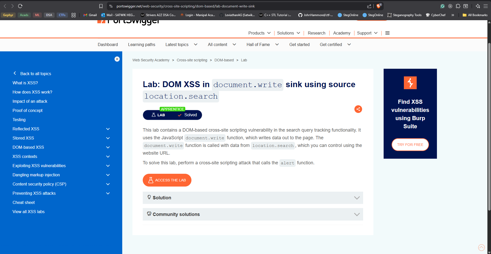

# DOM XSS in innerHTML sink using source location.search

# Solved



# Solution 

When we visit the webpage, we are given a blog page with a search bar which is what we need to exploit due to the challenge description.


Also the chall description literally tells us the vuln but recon is a part of solving challs but for learning purpose lets dig deep into : DOM-based cross-site scripting vulnerability.


- first and foremost i sent a random string of characters and saw this in the source : 

```js

function trackSearch(query) {
    document.write('');
}
var query = (new URLSearchParams(window.location.search)).get('search');
if(query) {
            trackSearch(query);
}
                    
```


- so i researched on what this JS snippet is doing : 

- trackSearch is a  function that basically recieves a param QUERY which call document.write which is a DOM manipulator which ive previously used in Puppeteer scripting to input stuff into fields.
- var query gets assigned to our input in the search bar. we are searching for the search input in the URLparams basically.

-  if query exists we call trackSearch


----

- so our query is being written onto the webpage using a DOM manip functions so that is what we have to exploit since thats the challenge name.

- now the only malicious thing we can do is somehow getting code execution and i think we can only do this using the query to get out of the src tag.

- which is kind of easy since we know the function and we can input JS into onload function
- https://github.com/payloadbox/xss-payload-list - if u search for img here u get some payloads. i used onload to induce an alert

- final payload : `" onload="alert('hi')` which worked and I solved this lab.

-


# Resources 

https://owasp.org/www-community/attacks/xss/

https://github.com/payloadbox/xss-payload-list