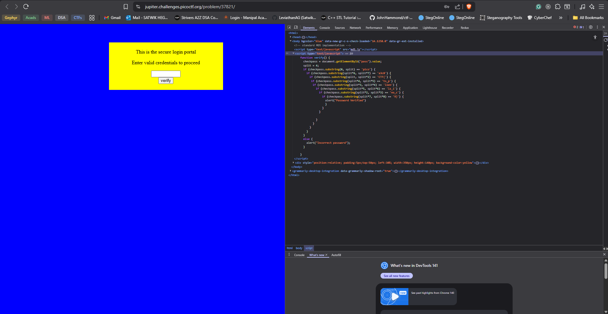

# dont use client sided

# Flag :

`picoCTF{no_clients_plz_1a3c89}`


# Solve 

- if you visit the url, u get an authentication webpage.


- since the chall name is dont use `client sided` and its standard protocol to look at the source anyways. i went into dev tools to find the flag easily.


- the flag is used to verify the credenmtials which is very unsafe.




```js

function verify() {
    checkpass = document.getElementById("pass").value;
    split = 4;
    if (checkpass.substring(0, split) == 'pico') {
      if (checkpass.substring(split*6, split*7) == 'a3c8') {
        if (checkpass.substring(split, split*2) == 'CTF{') {
         if (checkpass.substring(split*4, split*5) == 'ts_p') {
          if (checkpass.substring(split*3, split*4) == 'lien') {
            if (checkpass.substring(split*5, split*6) == 'lz_1') {
              if (checkpass.substring(split*2, split*3) == 'no_c') {
                if (checkpass.substring(split*7, split*8) == '9}') {
                  alert("Password Verified")
                  }
                }
              }
      
            }
          }
        }
      }
    }
    else {
      alert("Incorrect password");
    }
    
  }
```

# Mitigations

donot hardcode ur password in the frontend.


# Resources

None used