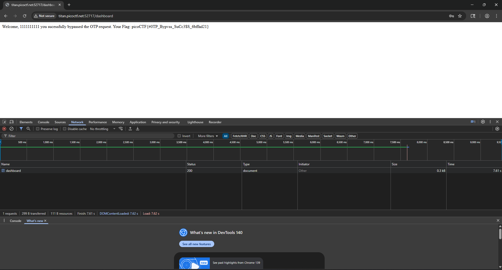

# intro to burp (easy)

# flag 

`picoCTF{#0TP_Bypvss_SuCc3$S_6bffad21}`

# solve :

the name literally says intro to burp so its prolly releated to intercepting requests. lets try intercepting the requests and changing payloads.

- i inspected the webpage and its a normal registration screen so i went into brup interceptor and tried changing payload but nothing happened. 

- when we send a valid payload we get into an mfa where screen.

- i tried multiple payload changes like otp = /flag and other endpoints and tried some sqli/xss payloads which didnt work.

- finally i removed the otp payload itself and sent an empty `POST` request which got me the flag.

# mitigations 

handle different payloads properly.

# resources

None used.

