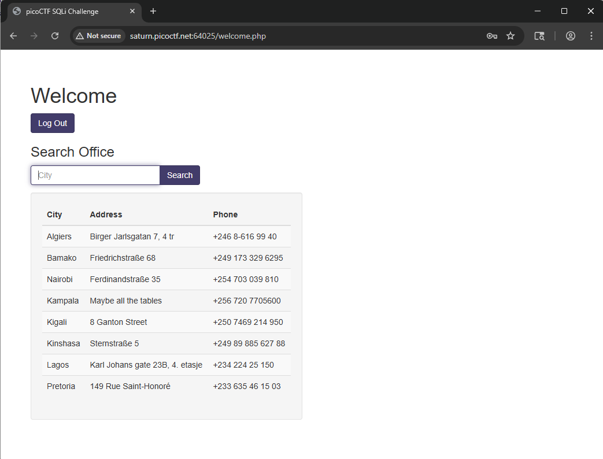

# More SQLi

# Flag : 

`picoCTF{G3tting_5QL_1nJ3c7I0N_l1k3_y0u_sh0ulD_c8b7cc2a}`

# Solve

- from the chall name we know its sqli : 
- if we induce an internal server error we are able to see the sql query

- we can intercept the request in burp and change the password payload 

- so i tried this input  : `' OR 1=1; --` in the password column because the query checks password first and we can comment out the rest of the query.

- this bypasses the authentication easily 

- we get this :
- 

- now lets try searching for something in the website.

- it looks for an exact match and fuzzy searches dont work.

- i think the search query looks like this : 

- `SELECT city,address,phone from city WHERE city = 'payload'`

- lets try inserting `WHERE city = 'payload' UNION SELECT 1,2,3 --'`
- where payload is LAGOS which returned the lagos row.
- now i tried enumerating all the cols but i didnt work so i looked at the hint which pointed towards SQLite so i used this website : https://swisskyrepo.github.io/PayloadsAllTheThings/SQL%20Injection/SQLite%20Injection/#sqlite-enumeration to craft this payload : `Lagos' UNION SELECT sql,1,1 FROM sqlite_master;--` which showed me this :

we can get the flag now easily with this payload : 

`' union select flag,id,1 from more_table;--`

`picoCTF{G3tting_5QL_1nJ3c7I0N_l1k3_y0u_sh0ulD_c8b7cc2a}`

# resources 
https://swisskyrepo.github.io/PayloadsAllTheThings/SQL%20Injection/SQLite%20Injection/#summary
