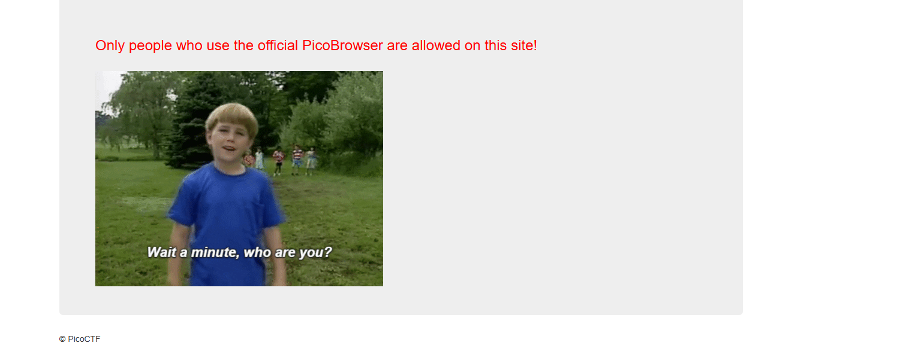
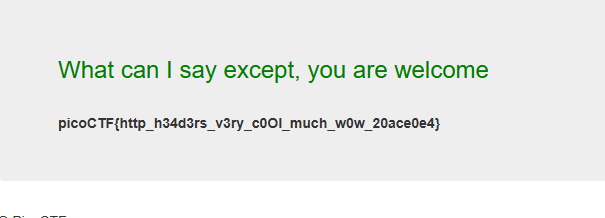

# Who are you? 

# Flag
`picoCTF{http_h34d3rs_v3ry_c0Ol_much_w0w_20ace0e4}`
# Solve 

on opening the website we are greeted with this image :

 

and a text.

- so we capture the request in burp and change the user-agent to `PicoBrowser`
- next the site tells me that "I dont trust users from other websites"

- So, I added a referer header `Referer: mercury.picoctf.net:38322`, adding the website as its own referer.

- next we are given  "Sorry this site only worked in 2018", So i added a date header `Date: Tue, 19 Jun 2018 11:31:12 GMT`

- next we get :  "I dont trust users who can be tracked".

- so we add a  do not track header `DNT: 1`

- next prompt : "The website is only for people from Sweden", so i changed the location and language to Sweden and Swedish, 
`Accept-Language: sv-sv,sv;q=0.5` and `X-Forwarded-For: 51.59.121.34`.

With all of these headers in place, i finally got the flag.

**Final Payload**
```
GET / HTTP/1.1
Host: mercury.picoctf.net:39114
Cache-Control: max-age=0
Accept-Language: sv-sv,sv;q=0.5
Upgrade-Insecure-Requests: 1
User-Agent: PicoBrowser
Accept: text/html,application/xhtml+xml,application/xml;q=0.9,image/avif,image/webp,image/apng,*/*;q=0.8,application/signed-exchange;v=b3;q=0.7
Accept-Encoding: gzip, deflate, br
Connection: keep-alive
Referer: mercury.picoctf.net:39114
Connection: keep-alive
Date: Mon, 17 Sep 2018 12:34:56 GMT
X-Forwarded-For: 51.59.121.34
DNT: 1
Content-Length: 3


```

Thus we get the flag :



## Resources
- https://datatracker.ietf.org/doc/html/rfc2616